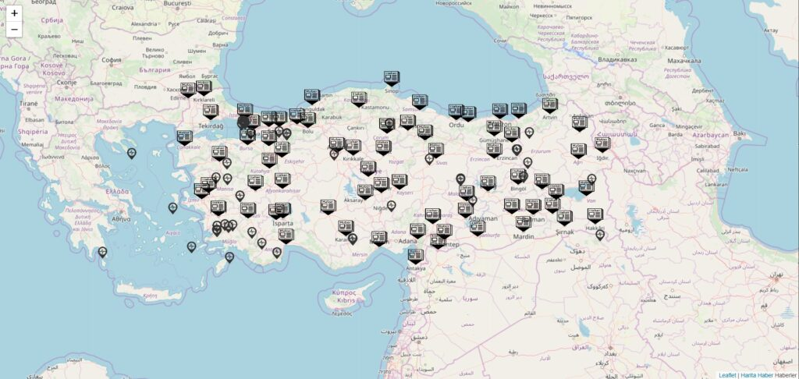

## İnteraktif Harita Projesi

Yazılım Tasarım Ve Mimarisi Dersi için geliştirdiğim İnteraktif Harita Uygulaması.

Proje Demosu: https://furkanatesli.github.io/interaktif-harita/index.html</br>
Canlı Demo: http://18.195.119.219/</br>

#### Amaç

Projede amaç kullanıcıların istedikleri haberleri metinsel olarak değilde harita üzerinde interaktif bir şekilde görmelerini ve istediği bölgedeki haberin içeriğini gömesini sağlamaktır.

#### Kapsam

Projenin kapsamı içerik olarak verileri düzenli ve koordinat bilgisi sunan ve koordinat bilgisi değişken olmayan haber kaynaklarındaki bilgilerin harita üzerinde gösterebilir. Haber kaynaklarına ek olarak verilerinde koordinat bilgisi olan tüm içerikler interaktif harita üzerinde gösterilebilir.

#### Referans Materyaller

Projede kullanılan bot için "Python" dili kullanılmıştır.</br>
Harita üzerinde işaretçilerin gösterilmesi için ‘JavaScript’ dili kullanılmıştır.</br>
Haber ve Deprem bilgilerini Python üzerinde kaynaklardan çekmek için "BeautifulSoup" ve "urllib" modülleri kullanılmıştır.</br>
Haber veri kaynağı olarak "https://www.haberler.com/" kullanılmıştır.</br>
Deprem veri kaynağı olarak "http://www.koeri.boun.edu.tr/scripts/lst1.asp" kullanılmıştır.</br>
Elde edilen verileri işleyip bir harita üzerinde göstermek için "https://leafletjs.com/" kullanılmıştır.</br>
Harita kaynağı olarak "https://www.openstreetmap.org/" kullanılmıştır.</br>

#### Tanımlar Ve Kısaltmalar

Urllib: Url’ler ile işlemler yapmak için oluşturulmuş bir Python kütüphanesi.</br>
BeautifulSoup: HTML veya XML dosyalarını işlemek için oluşturulmuş güçlü ve hızlı bir Python kütüphanesidir.</br>
OpenStreetMap: Kullanımı serbest ve açık lisans altında olan bir dünya haritasıdır.</br>
Leaflet: Mobil uyumlu interaktif haritalar için açık kaynaklı bir JavaScript kütüphanesidir.</br>

#### Sistem Görünümü

Sistem Python’da yazılan bot sayesinde kaynaklardan gerekli olan verileri çekip gelen bu verileri Leaflet kütüphanesinin anlayacağı bir şekilde .js uzantılı bir dosya olarak kayıt eder. Kaynaklardan gelen bu verileri güncel olarak görmek için botun en az bir kez çalışması gereklidir. Gelen verileri harita üzerinde görmek için Html dosyası olan index.html açılır.


#### Tasarım Gerekçesi

Haber kaynağı olarak haberler.com kaynağının seçilmesinin sebebi illere göre girilen haberlerin
her biri için ayrı bir URL almasıdır. Ve bu URL’lerin XML dosyalarının içerik bilgilerini kısa ve öz olarak girilmiş olması bu kaynağı seçmemi sağlamıştır. Kaynakta koordinat bilgilerinin olmaması sebebiyle koordinatlar Python’da bir liste şeklinde belirledim. Koordinat ve il denkleşmesini sayaç adında bir değişken kullanarak sehirler listesi ve koordinatlar listesini eşitledim. Bu sayede işlem gören şehire ait koordinatı .js dosyasına kayıt edebildim.
Deprem kaynağı olarak Kandilli Rasathanesinin seçilmesinin sebebi Türkiye’de deprem yayınlarını hızlı ve detaylı bir şekilde yapmasıdır. Ayrıca alanında Türkiye’de merkezi konumda olması ve Türkiye ve çevresindeki bazı bölgelerinde deprem bilgilerini paylaşmasıdır.

#### Veri Tanımlaması

Sistemde şu anda, illerin son haberleri ve son 24 saatte Türkiye’de olan depremler olarak iki adet veri kaynağı vardır.

#### Haber Kaynağı

Haber verilerini illere göre çekmek için kaynağımız olan haber sitesinin XML kaynağına ("https://rss.haberler.com/rsskonu.asp?konu=") erişiyoruz. Bu URL’nin sonuna istediğimiz bir ilin adını girerek bu istenilen ilin son girilen haberlerini XML olarak görebiliyoruz. Bizim amacımız bu URL’nin tüm Türkiye illerini kapsaması ve illere ait girilen son haber verisinin işlenip haritamız üzerinde gösterilmesi. Bunun için de Python’da illerin isimlerinin yazılı olduğu bir liste(sehirler), bu illere ait olan koordinatları bulunduran ikinci bir liste(koordinatlar) ve haberleri çekebilmek için bir fonksiyon yazdım(haber_cek). Bu fonksiyonda ilk olarak bir sayaç belirledik sonra bir döngü belirledik bu döngü illerin isimlerinin yazılı olduğu liste kadar dönecek. Her döngüde haber kaynağımız olan URL’yi ulrlib kütüphanesi ile açıp BeautifulSoup kütüphanesi ile XML belgesi şeklinde okutup bu XML belgesinde geçen ilk ‘item’ isimli tagı bulup bu tag içerisinde ki tüm verileri UTF-8 formatında kaynak isimli değişkenimize kayıt ediyor. Yine döngü içerisinde dosya açıyor dosya hedefi olarak proje klasörünün içerisindeki Haberler klasörünü seçiyor dosya ismini o anki döngüde bulunan şehir ismi olarak uzantısını da .js yani JavaScript olarak oluşturuyor ve sadece yazılabilir şekilde açıyor. Dosya içerisine kaynak siteden gelen verileri Leaflet’in işaretçi ve popup olayına uygun bir şekilde kayıt ediyor. Kayıt ederken, işaret kontrolü için koordinat dizisinin içerisindeki koordinatlar gelen verideki ile karşılık gelen koordinatı alıyor. Popup bilgisi için gelen verideki title, description, link ve pubDate tagları içerisindeki verileri UTF-8 formatına çevirip JavaScrip dosyamıza kayıt ediliyor. Ardından dosyayı kapatıyor ve sayaç değişkenini bir arttırıyor.

#### Deprem Kaynağı

Deprem verilerini çekmek için kaynağımız olan Boğaziçi Üniversitesi Kandilli Rasathanesi ve Deprem Araştırma Enstitüsü Bölgesel Deprem-Tsunami İzleme Ve Değerlendirme Merkezi’nin sağladığı verilerin XML kaynağına ("http://udim.koeri.boun.edu.tr/zeqmap/xmlt/son24saat.xml") erişiyoruz. Bu URL’de Türkiye de son 24 saat içerisinde olan depremler listelenmektedir. Buradaki amacımız bu URL’deki verileri işleyip harita üzerinde göstermek. Bunun için de Python’da bu verileri çekip işleyen bir fonksiyon yazdım(deprem_cek). Bu fonksiyonda ilk olarak Deprem verilerini aldığımız XML url’sini urllib kütüphanesi ile açıp BeautifulSoup kütüphanesi ile XML belgesi şeklinde okutuyoruz. Sonra bir dosya oluşturuyoruz dosya hedefi olarak proje klasörünün içerisindeki Depremler klasörünü seçiyor dosya ismini Depremler olarak uzantısınıda .js yani JavaScript olarak oluşturuyor ve sadece yazılabilir şekilde açıyor. Sonra bir döngü oluşturup bu döngüyü XML belgesinde geçen ‘earhquake’ tagı kadar döndürüyoruz. Döngüde dosya içerisine kaynak siteden gelen verileri Leaflet’in işaretçi ve popup olayına uygun bir şekilde kayıt ediyor.
Kayıt ederken, işaret kontrolü için kaynak siteden gelen XML’i içerisindeki ‘lat’ ve ‘lng’ verilerini alıyor. Popup bilgisi için gelen verideki ‘earhquake’ tag’ı içerisindeki ‘name’,’lokasyon’,’mag’ ve ‘Depth’ tagrarı içerisindeki verileri JavaScript dosyamıza kayıt ediyor. Ardından dosyamızı kapatıyor.

#### Veri Sözlüğü

Sehirler: Türkiye’deki sehirlerin isimlerinin yazılı olduğu liste.</br>
Koordinatlar: Türkiye’deki şehirlerin koordinatlarının yazılı olduğu liste.</br>
Deprem_cek: Kaynaktan deprem verilerini çekmeyi sağlayan fonksiyon.</br>
Haber_cek: Kaynaktan haber verilerini çekmeyi saylayan fonksiyon.</br>
Kaynak: Kaynaklardan gelen verilerin içeriklerin saklandığı değişken.</br>
Oku: Kaynak URL’den gelen verilerin saklandığı değişken.</br>
Sayaç: Şehirler ve Koordinat uyumunu sağlayan liste.</br>

#### Bileşen Tasarımı
```
def deprem_cek():

	//url oku ve oku isimli değişkene at
	//oku değişkenini XML olarak oku ve kaynak isimli değişkene at	
	//Depremler klasöründe Depremler isimli .js dosyası aç	
	//kaynak değişkenindeki earhquake tagı kadar dön	
	//dosya içerisine leaflet kütüphanesinin anlayacağı şekilde verileri kayıt et	
	//dosyayı kapat	
```
```
def haber_cek():

	//sayaç isimli değeri 0 olan bir değişken oluştur
	//sehirler listesi kadar dön
	//url oku ve oku isimli değişkene at
	//oku değişkenini XML olarak oku ve kaynak isimli değişkene at
	//kaynak değişkenin içerisindeki ilk item tagını bul
	//Haberler klasöründe İle ait il adında bir .js dosyası aç
	//dosya içerisine leaflet kütüphanesinin anlayacağı şekilde verileri kayıt et
	//dosyayı kapat
	//sayacı 1 arttır
```



#### Ekran Nesneleri Ve Eylemleri

Harita: Mouse sol tık hareketi ile gezinti yapılabilir.</br>
Ekranın sol üstünde bulunan eksi ve artı butonları: Haritayı yakınlaştırıp uzaklaştırmayı sağlar.</br>
Haber İşaretçisi: Haberin hangi ilde olduğunu harita üzerinde gösterir, tıklandığında popup olayı gerçekleşir ve haber detaylarını gösterir.</br>
Deprem İşaretçisi: Depremin olduğu noktayı gösterir, tıklandığında popup olayı gerçekleşir ve deprem detaylarını gösterir.</br>

#### :warning: Gereksinimler Matrisi
```
*Bot için Python 2.7.15 sürümü.
*Python’da URL’leri açmak için urllib kütüphanesi.
*Python’da açılan URL’leri okumak için BeautifulSoup kütüphanesi.
*Haberler için haber kaynağı.
*Depremler için deprem veri kaynağı.
*Arayüzde harita göstermek için OpenStreetMap.
*Harita üzerinde işaretçilerin gösterilmesi ve popup olayları için "JavaScript" dili.
*Harita üzerinde işaretçileri göstermek için JavaScript Leaflet kütüphanesi.
```

#### Ekler

Leaflet Dokümantasyonu – https://leafletjs.com/reference-1.3.4.html</br>
Urllib Modülü Dokümantasyonu – https://docs.python.org/3/library/urllib.html</br>
BeautifulSoup Modülü Dokümantasyonu – https://www.crummy.com/software/BeautifulSoup/bs4/doc/</br>
